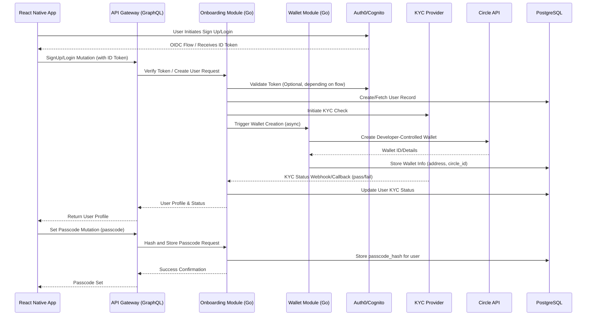
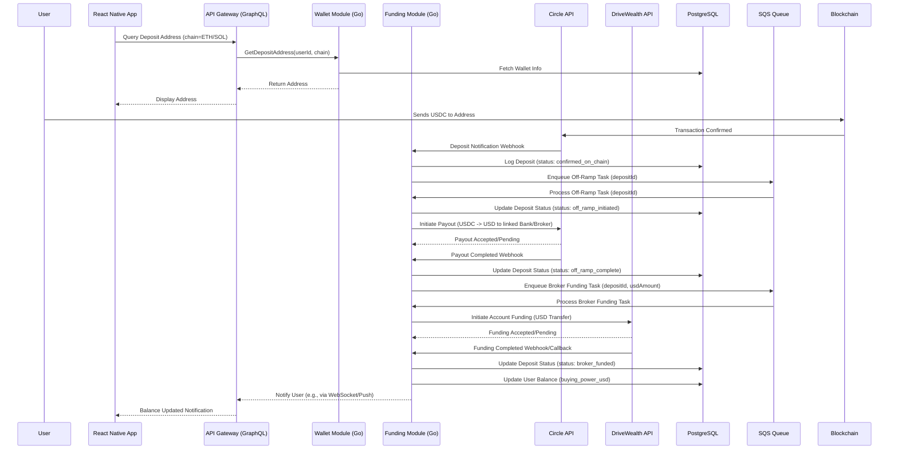
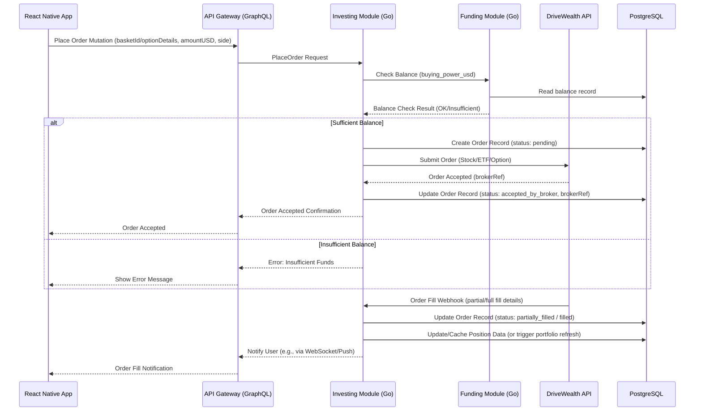
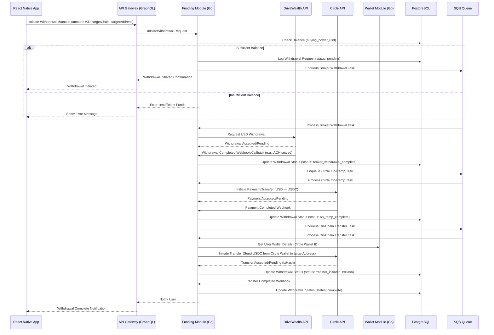

### STACK Architecture Document (v0.2 - Go/DriveWealth)

## 1\. Introduction

This document outlines the overall project architecture for STACK, refactored for a **Go** backend. It details the integration of **Circle Developer-Controlled Wallets** for wallet management/funding and **DriveWealth** as the brokerage partner. Its primary goal is to serve as the guiding architectural blueprint for AI-driven development.

**Relationship to Frontend Architecture:**
This document covers the backend services. A separate Frontend Architecture Document (for React Native) MUST be used in conjunction with this one.

  * **Starter Template or Existing Project:** N/A - Greenfield project. We are defining the structure from scratch.

  * **Change Log:**
    | Date | Version | Description | Author |
    | :--- | :--- | :--- | :--- |
    | Sept 27, 2025 | v0.1 | Initial NestJS architecture. | Winston |
    | Oct 24, 2025 | v0.2 | Complete rewrite for Go, DriveWealth, and Circle pivot. | Winston |

-----

## 2\. High Level Architecture

#### 2.1 Technical Summary

This architecture is a **Go-based modular monolith** deployed on AWS Fargate (ECS). The system exposes a unified GraphQL API (via an API Gateway) to the React Native mobile app. It integrates three critical external partners: **Auth0/Cognito** (Identity), **Circle** (Wallets, USDC On/Off-Ramps), and **DriveWealth** (Brokerage, Custody). Data is persisted in **PostgreSQL**. This design supports the MVP goal of providing a hybrid Web3-to-TradFi investment flow.

#### 2.2 High Level Overview

  * **Architectural Style:** Modular Monolith (to start).
  * **Repository Structure:** Monorepo (recommended).
  * **Service Architecture:** A single Go application separated into logical domain modules (Onboarding, Wallet, Funding, Investing, AI-CFO) that communicate internally.
  * **Data Flow (Funding):** User deposits USDC (on-chain) -\> Monitored by Funding Service -\> Circle Off-Ramp (USDC to USD) -\> DriveWealth Deposit (USD) -\> "Buying Power" updated.
  * **Data Flow (Withdrawal):** User requests USD withdrawal -\> DriveWealth debits account -\> Circle On-Ramp (USD to USDC) -\> Funding Service sends USDC (on-chain) to user.

#### 2.3 High Level Project Diagram

```mermaid
graph TD
    U[Gen Z User (Mobile)] --> RN[React Native App]

    subgraph "STACK Backend (Go Modular Monolith on AWS Fargate)"
        RN --> GW[API Gateway (GraphQL)]
        GW --> ONB[Onboarding Service]
        GW --> WAL[Wallet Service]
        GW --> FND[Funding Service]
        GW --> INV[Investing Service]
        GW --> AIC[AI CFO Service]

        ONB --> PG[(PostgreSQL)]
        WAL --> PG
        FND --> PG
        INV --> PG
        AIC --> PG
    end

    subgraph "External Partners"
        ONB --> IDP[Auth0 / Cognito]
        ONB --> KYC[KYC/AML Provider]
        WAL --> CIR[Circle API (Developer Wallets)]
        FND --> CIR
        INV --> DW[DriveWealth API (Brokerage)]
        AIC --> OG[0G (AI/Storage)]
    end
```

#### 2.4 Architectural and Design Patterns

  * **Modular Monolith:** A single Go application with strongly defined internal boundaries (Go modules) for each domain (Onboarding, Funding, etc.). This allows for faster MVP development while making future extraction into microservices straightforward.
  * **Repository Pattern:** Used to abstract all database interactions. Go interfaces will define data access methods, with concrete implementations for PostgreSQL, ensuring testability and separation of concerns.
  * **Adapter Pattern:** Used extensively for all external partner integrations (Circle, DriveWealth, 0G). Go interfaces will define the *required* functionality (e.g., `BrokerageAdapter`), and concrete structs will implement those interfaces by calling the specific partner APIs.
  * **Asynchronous Orchestration (Sagas):** The complex funding (USDC -\> USD -\> Broker) and withdrawal (Broker -\> USD -\> USDC) flows will be managed using an asynchronous, event-driven approach (even within the monolith) to handle multi-step processes and failures.

Okay, thanks for those specifics. I've updated the Tech Stack section with your choices for the Go backend components. The TBDs for the web framework, logging, DB driver, and caching are now resolved.

Here's the updated **Section 3: Tech Stack**.

---

## 3. Tech Stack

This section defines the specific technologies and versions that **MUST** be used for the STACK MVP implementation. These choices are based on the **Go** backend requirement, **React Native** frontend, and integration with **Circle** and **DriveWealth**.

**Rationale:** The stack prioritizes mature ecosystems, type safety where possible (Go/TypeScript), and alignment with our chosen partners and cloud platform (AWS). Specific versions are pinned to ensure consistency and avoid unexpected breaking changes.

#### 3.1 Cloud Infrastructure
* **Provider:** AWS
* **Key Services:** Fargate (ECS), RDS (PostgreSQL), **ElastiCache (Redis)**, SQS, Secrets Manager, S3, API Gateway (REST/GraphQL endpoint), CloudFront, WAF
* **Deployment Regions:** TBD (e.g., us-east-1)

#### 3.2 Technology Stack Table

| Category           | Technology                    | Version         | Purpose                                          | Rationale                                                                 |
| :----------------- | :---------------------------- | :-------------- | :----------------------------------------------- | :------------------------------------------------------------------------ |
| **Backend Lang** | Go                            | 1.21.x          | Primary backend language                         | Mandated requirement, performant, strong concurrency model                |
| **Backend Fmwk** | **Gin** | **v1.11.0** | Web framework for API                            | User specified, high-performance, minimalist Go framework                 |
| **Database** | PostgreSQL                    | 15.x            | Primary relational data store                    | Mature, reliable, supports JSONB, RDS managed service       |
| **ORM/DB Driver** | **lib/pq** | **Latest** | PostgreSQL driver for Go                         | User specified, standard Go driver for PostgreSQL                         |
| **Migration Tool** | TBD (e.g., goose, migrate)    | TBD             | Database schema migrations                       | Need standard Go migration tool                                           |
| **Queueing** | AWS SQS                       | N/A (AWS SDK)   | Asynchronous task processing (funding flow)      | Managed service, integrates well with Go SDK                              |
| **Cache** | **Redis** | **7.x** | Caching layer                                    | User specified via ecosystem choice, use with ElastiCache                 |
| **Cache Client (Go)**| TBD (e.g., go-redis)        | TBD             | Go client library for Redis                      | Needed to interact with Redis from Go                                     |
| **Frontend Lang** | TypeScript                    | 5.x             | Language for React Native app                    | Type safety, improves developer experience                                |
| **Frontend Fmwk** | React Native                  | 0.72.x          | Cross-platform mobile framework                  | Specified requirement                                      |
| **State Mgmt (FE)**| TBD (e.g., Zustand, Redux TK) | TBD             | Frontend state management                        | Choice depends on app complexity, Zustand is lighter                      |
| **API Style** | GraphQL                       | TBD (Lib: gqlgen)| API for mobile client                            | Approved, efficient data fetching for mobile, Go lib needed              |
| **API Docs (BE)** | **gin-swagger** | **Latest** | Swagger/OpenAPI generation for Gin             | User specified, standard for documenting Gin APIs                         |
| **Auth Provider** | TBD (Auth0 / Cognito)         | N/A             | User identity and authentication                 | Standard OIDC providers, need final selection                             |
| **Wallet/Funding** | Circle API                    | Latest          | Developer Wallets, USDC On/Off-Ramp            | Mandated requirement                                       |
| **Brokerage** | DriveWealth API               | Latest          | Stock/Options trading, Custody                 | Mandated requirement                                       |
| **AI/Storage** | 0G                            | Latest          | AI CFO features, data storage                  | Specified requirement                                      |
| **IaC Tool** | Terraform                     | 1.6.x           | Infrastructure as Code                           | Industry standard, manages AWS resources                                  |
| **CI/CD** | GitHub Actions                | N/A             | Continuous Integration/Deployment                | Integrates with GitHub repo                       |
| **Containerization**| Docker                        | Latest          | Container builds                                 | Standard for Fargate deployment                                           |
| **Logging (BE)** | **Zap** | **Latest** | Structured logging in Go                         | User specified, performant structured logger                              |
| **Tracing (BE)** | **OpenTelemetry** | **Latest** | Distributed tracing                              | User specified, standard for observability                                |
| **Metrics (BE)** | **Prometheus Client (Go)** | **Latest** | Exposing application metrics                     | User specified via ecosystem choice                                       |
| **Circuit Breaker**| **gobreaker** | **Latest** | Resilience pattern for external calls            | User specified via ecosystem choice                                       |
| **Monitoring** | AWS CloudWatch / Datadog      | N/A             | Metrics, Logs, Traces                            | CloudWatch default, Datadog if more advanced features needed             |

---

## 4. Data Models

Based on the original architecture and the PRD, these are the core data entities required for the MVP. I'll define their purpose, key attributes, and relationships.

#### 4.1 users
* **Purpose:** Represents an end-user of the STACK application.
* **Key Attributes:**
    * `id`: UUID (Primary Key)
    * `auth_provider_id`: String (e.g., Auth0/Cognito subject claim, unique)
    * `email`: String (Indexed, unique)
    * `phone_number`: String (Optional, Indexed, unique)
    * `kyc_status`: Enum (`not_started`, `pending`, `approved`, `rejected`)
    * `passcode_hash`: String (Hashed passcode for app login)
    * `created_at`: Timestamp
    * `updated_at`: Timestamp
* **Relationships:**
    * One-to-Many with `wallets`
    * One-to-Many with `deposits`
    * One-to-One with `balances`
    * One-to-Many with `orders`
    * One-to-Many with `positions`
    * One-to-One with `portfolio_perf` (potentially, or track history)
    * One-to-Many with `ai_summaries`

#### 4.2 wallets
* **Purpose:** Stores metadata about Circle Developer-Controlled Wallets associated with a user.
* **Key Attributes:**
    * `id`: UUID (Primary Key)
    * `user_id`: UUID (Foreign Key to `users.id`)
    * `chain`: Enum (`ethereum`, `solana`, etc.)
    * `address`: String (Chain-specific address, Indexed)
    * `circle_wallet_id`: String (Reference to Circle's wallet ID)
    * `status`: Enum (`creating`, `active`, `inactive`)
    * `created_at`: Timestamp
    * `updated_at`: Timestamp
* **Relationships:**
    * Many-to-One with `users`

#### 4.3 deposits
* **Purpose:** Tracks incoming stablecoin deposits from the blockchain into the Circle wallet.
* **Key Attributes:**
    * `id`: UUID (Primary Key)
    * `user_id`: UUID (Foreign Key to `users.id`)
    * `wallet_id`: UUID (Foreign Key to `wallets.id`)
    * `chain`: Enum (`ethereum`, `solana`, etc.)
    * `tx_hash`: String (Blockchain transaction hash, Indexed, unique per chain)
    * `token`: Enum (`USDC`)
    * `amount_stablecoin`: Decimal (Amount deposited in USDC)
    * `status`: Enum (`pending_confirmation`, `confirmed_on_chain`, `off_ramp_initiated`, `off_ramp_complete`, `broker_funded`, `failed`)
    * `confirmed_at`: Timestamp (When confirmed on-chain)
    * `off_ramp_completed_at`: Timestamp (When Circle confirms USD conversion)
    * `broker_funded_at`: Timestamp (When DriveWealth confirms USD deposit)
    * `created_at`: Timestamp
    * `updated_at`: Timestamp
* **Relationships:**
    * Many-to-One with `users`
    * Many-to-One with `wallets`

#### 4.4 balances
* **Purpose:** Represents the user's *brokerage* buying power (in USD) available at DriveWealth. Circle balances are managed via Circle API.
* **Key Attributes:**
    * `user_id`: UUID (Primary Key, Foreign Key to `users.id`)
    * `buying_power_usd`: Decimal (Amount available for trading at DriveWealth)
    * `pending_broker_deposits_usd`: Decimal (Amount in flight from Circle off-ramp to DriveWealth)
    * `updated_at`: Timestamp
* **Relationships:**
    * One-to-One with `users`

#### 4.5 baskets
* **Purpose:** Stores the definition of curated investment baskets.
* **Key Attributes:**
    * `id`: UUID (Primary Key)
    * `name`: String
    * `description`: String
    * `risk_level`: Enum (`conservative`, `balanced`, `growth`)
    * `composition_json`: JSONB (Stores array of {symbol, weight})
    * `is_active`: Boolean
    * `created_at`: Timestamp
    * `updated_at`: Timestamp
* **Relationships:**
    * One-to-Many with `orders`
    * One-to-Many with `positions` (indirectly via orders/brokerage data)

#### 4.6 orders
* **Purpose:** Tracks user requests to buy or sell assets (baskets or options) via DriveWealth.
* **Key Attributes:**
    * `id`: UUID (Primary Key)
    * `user_id`: UUID (Foreign Key to `users.id`)
    * `basket_id`: UUID (Optional, Foreign Key to `baskets.id`, null for options)
    * `asset_type`: Enum (`basket`, `option`)
    * `option_details_json`: JSONB (Optional, stores option contract specifics if `asset_type` is `option`)
    * `side`: Enum (`buy`, `sell`)
    * `amount_usd`: Decimal (Target order amount in USD)
    * `status`: Enum (`pending`, `accepted_by_broker`, `partially_filled`, `filled`, `failed`, `canceled`)
    * `drivewealth_order_ref`: String (Reference from DriveWealth API, Indexed)
    * `created_at`: Timestamp
    * `updated_at`: Timestamp
* **Relationships:**
    * Many-to-One with `users`
    * Many-to-One with `baskets` (nullable)

#### 4.7 positions (Derived/Cached)
* **Purpose:** Represents the user's current holdings at DriveWealth. This might be primarily fetched from DriveWealth and cached locally, rather than being the system of record.
* **Key Attributes:**
    * `user_id`: UUID (Foreign Key to `users.id`)
    * `symbol`: String (e.g., VTI, or option contract symbol)
    * `quantity`: Decimal
    * `average_price`: Decimal
    * `asset_type`: Enum (`stock`, `etf`, `option`)
    * `last_updated_at`: Timestamp (Cache timestamp)
* **Relationships:**
    * Many-to-One with `users`

#### 4.8 ai_summaries
* **Purpose:** Stores the generated AI CFO summaries.
* **Key Attributes:**
    * `id`: UUID (Primary Key)
    * `user_id`: UUID (Foreign Key to `users.id`)
    * `week_start_date`: Date
    * `summary_markdown`: Text
    * `generated_at`: Timestamp
* **Relationships:**
    * Many-to-One with `users`

*(Note: `portfolio_perf` and `audit_logs` from the original doc are important but might be deferred slightly post-MVP core functionality or derived differently).*

Okay, let's proceed to **Section 5: Components**.

-----

## 5\. Components

The STACK backend will start as a **Go-based modular monolith**. Functionality is divided into distinct Go modules, each responsible for a specific domain. These modules communicate internally via Go function calls and interfaces initially.

#### 5.1 Component List

  * **Onboarding Service Module**

      * **Responsibility:** Handles user sign-up, profile management, KYC/AML orchestration, passcode setup/verification, and feature flag checks.
      * **Key Interfaces:**
          * Internal: `CreateUser`, `GetUserProfile`, `UpdateKYCStatus`, `SetPasscode`, `VerifyPasscode`.
          * External (via GraphQL Gateway): Mutations for sign-up, profile updates; Queries for user status.
      * **Dependencies:** `Auth Provider (IDP)`, `KYC/AML Provider`, `Wallet Service Module` (to trigger wallet creation), `Database (users table)`.
      * **Technology Stack:** Go module.

  * **Wallet Service Module**

      * **Responsibility:** Manages the lifecycle of Circle Developer-Controlled Wallets, including creation and association with users. Provides addresses for deposits.
      * **Key Interfaces:**
          * Internal: `CreateUserWallet`, `GetDepositAddress`.
          * External (via GraphQL Gateway): Query for deposit addresses.
      * **Dependencies:** `Circle API`, `Database (users, wallets tables)`.
      * **Technology Stack:** Go module.

  * **Funding Service Module**

      * **Responsibility:** Orchestrates the entire funding and withdrawal flow: monitors blockchain deposits, triggers Circle off-ramps (USDC-\>USD), confirms DriveWealth funding, handles withdrawal requests (DriveWealth-\>USD-\>USDC), and manages related state transitions.
      * **Key Interfaces:**
          * Internal: `HandleChainDepositEvent`, `InitiateOffRamp`, `ConfirmBrokerFunding`, `InitiateWithdrawal`, `HandleWithdrawalCompletion`. Listens for events from blockchain monitors/webhooks.
          * External (via GraphQL Gateway): Query for deposit history/status, Mutation to initiate withdrawal.
      * **Dependencies:** `Blockchain Monitors/Webhooks`, `Circle API`, `DriveWealth API`, `Database (deposits, balances, users, wallets tables)`, `Queueing (SQS)` (for asynchronous steps).
      * **Technology Stack:** Go module, SQS.

  * **Investing Service Module**

      * **Responsibility:** Manages the investment lifecycle: provides basket catalog, places orders (baskets, options) with DriveWealth, retrieves portfolio positions/performance from DriveWealth, calculates basic P\&L.
      * **Key Interfaces:**
          * Internal: `GetBaskets`, `PlaceOrder`, `GetPortfolio`.
          * External (via GraphQL Gateway): Queries for baskets, portfolio; Mutations for placing orders.
      * **Dependencies:** `DriveWealth API`, `Database (baskets, orders, positions cache, users tables)`.
      * **Technology Stack:** Go module.

  * **AI CFO Service Module**

      * **Responsibility:** Generates weekly performance summaries and on-demand portfolio analysis using 0G for AI/storage. Pulls data via the Investing Service Module.
      * **Key Interfaces:**
          * Internal: `GenerateWeeklySummary`, `AnalyzePortfolioOnDemand`. Triggered by scheduler or internal events.
          * External (via GraphQL Gateway): Queries for latest summary, Mutation to trigger on-demand analysis.
      * **Dependencies:** `Investing Service Module` (for data), `0G API`, `Database (ai_summaries, users tables)`, `Scheduler` (e.g., AWS EventBridge).
      * **Technology Stack:** Go module.

#### 5.2 Component Diagrams

```mermaid
graph TD
    subgraph "STACK Backend (Go Modular Monolith)"
        GW[API Gateway (GraphQL)] --> ONB[Onboarding Module]
        GW --> WAL[Wallet Module]
        GW --> FND[Funding Module]
        GW --> INV[Investing Module]
        GW --> AIC[AI CFO Module]

        ONB --> WAL   # Triggers wallet creation
        FND <--> WAL  # Needs wallet info
        AIC --> INV   # Needs portfolio data
        FND <--> INV  # Needs balance updates, order info potentially
    end

    subgraph "Datastores"
        PG[(PostgreSQL)]
        Q[(SQS Queue)]
    end

    ONB --> PG
    WAL --> PG
    FND --> PG
    INV --> PG
    AIC --> PG
    FND --> Q # For async funding steps

    subgraph "External Partners"
        IDP[Auth0/Cognito]
        KYC[KYC Provider]
        CIR[Circle API]
        DW[DriveWealth API]
        OG[0G API]
    end

    ONB --> IDP
    ONB --> KYC
    WAL --> CIR
    FND --> CIR
    FND --> DW # For funding broker
    INV --> DW # For trading/portfolio
    AIC --> OG

    style PG fill:#lightblue
    style Q fill:#lightblue
    style IDP fill:#lightgrey
    style KYC fill:#lightgrey
    style CIR fill:#lightgrey
    style DW fill:#lightgrey
    style OG fill:#lightgrey
```

-----

## 7\. Core Workflows

These sequence diagrams illustrate the key interactions between components and external partners for critical user journeys in the Go-based architecture.

#### 7.1 Onboarding + Wallet Creation + Passcode Setup



#### 7.2 Funding Flow (USDC Deposit -\> Circle Off-Ramp -\> DriveWealth Funding)



#### 7.3 Investment Flow (Place Order for Stock/Option via DriveWealth)



#### 7.4 Withdrawal Flow (DriveWealth USD -\> Circle On-Ramp -\> USDC Transfer)




## 8\. Database Schema

Based on the data models defined in Section 4 and using PostgreSQL as our database, here is the initial DDL (Data Definition Language) for the MVP schema.

```sql
-- Extensions
CREATE EXTENSION IF NOT EXISTS "uuid-ossp";

-- Enums (Consider creating ENUM types for status fields for better type safety)
CREATE TYPE kyc_status AS ENUM ('not_started', 'pending', 'approved', 'rejected');
CREATE TYPE wallet_status AS ENUM ('creating', 'active', 'inactive');
CREATE TYPE chain_type AS ENUM ('ethereum', 'solana'); -- Add more supported chains
CREATE TYPE token_type AS ENUM ('USDC');
CREATE TYPE deposit_status AS ENUM (
    'pending_confirmation',
    'confirmed_on_chain',
    'off_ramp_initiated',
    'off_ramp_complete',
    'broker_funded',
    'failed'
);
CREATE TYPE withdrawal_status AS ENUM (
    'pending',
    'broker_withdrawal_initiated',
    'broker_withdrawal_complete',
    'on_ramp_initiated',
    'on_ramp_complete',
    'transfer_initiated',
    'complete',
    'failed'
);
CREATE TYPE asset_type AS ENUM ('basket', 'option', 'stock', 'etf');
CREATE TYPE order_side AS ENUM ('buy', 'sell');
CREATE TYPE order_status AS ENUM (
    'pending',
    'accepted_by_broker',
    'partially_filled',
    'filled',
    'failed',
    'canceled'
);
CREATE TYPE risk_level AS ENUM ('conservative', 'balanced', 'growth');

-- Tables
CREATE TABLE users (
    id UUID PRIMARY KEY DEFAULT uuid_generate_v4(),
    auth_provider_id VARCHAR(255) UNIQUE NOT NULL,
    email VARCHAR(255) UNIQUE,
    phone_number VARCHAR(50) UNIQUE,
    kyc_status kyc_status DEFAULT 'not_started' NOT NULL,
    passcode_hash VARCHAR(255), -- Store hashed passcode
    created_at TIMESTAMPTZ DEFAULT CURRENT_TIMESTAMP NOT NULL,
    updated_at TIMESTAMPTZ DEFAULT CURRENT_TIMESTAMP NOT NULL
);
CREATE INDEX idx_users_email ON users(email);
CREATE INDEX idx_users_phone ON users(phone_number);

CREATE TABLE wallets (
    id UUID PRIMARY KEY DEFAULT uuid_generate_v4(),
    user_id UUID NOT NULL REFERENCES users(id) ON DELETE CASCADE,
    chain chain_type NOT NULL,
    address VARCHAR(255) NOT NULL,
    circle_wallet_id VARCHAR(255) NOT NULL,
    status wallet_status DEFAULT 'creating' NOT NULL,
    created_at TIMESTAMPTZ DEFAULT CURRENT_TIMESTAMP NOT NULL,
    updated_at TIMESTAMPTZ DEFAULT CURRENT_TIMESTAMP NOT NULL,
    UNIQUE (user_id, chain) -- Assuming one wallet per chain per user initially
);
CREATE INDEX idx_wallets_user_id ON wallets(user_id);
CREATE INDEX idx_wallets_address ON wallets(address);

CREATE TABLE deposits (
    id UUID PRIMARY KEY DEFAULT uuid_generate_v4(),
    user_id UUID NOT NULL REFERENCES users(id) ON DELETE CASCADE,
    wallet_id UUID NOT NULL REFERENCES wallets(id),
    chain chain_type NOT NULL,
    tx_hash VARCHAR(255) NOT NULL,
    token token_type DEFAULT 'USDC' NOT NULL,
    amount_stablecoin DECIMAL(36, 18) NOT NULL, -- High precision for crypto
    status deposit_status DEFAULT 'pending_confirmation' NOT NULL,
    confirmed_at TIMESTAMPTZ,
    off_ramp_initiated_at TIMESTAMPTZ,
    off_ramp_completed_at TIMESTAMPTZ,
    broker_funded_at TIMESTAMPTZ,
    failure_reason TEXT,
    created_at TIMESTAMPTZ DEFAULT CURRENT_TIMESTAMP NOT NULL,
    updated_at TIMESTAMPTZ DEFAULT CURRENT_TIMESTAMP NOT NULL,
    UNIQUE (chain, tx_hash)
);
CREATE INDEX idx_deposits_user_id ON deposits(user_id);
CREATE INDEX idx_deposits_status ON deposits(status);

CREATE TABLE withdrawals (
    id UUID PRIMARY KEY DEFAULT uuid_generate_v4(),
    user_id UUID NOT NULL REFERENCES users(id) ON DELETE CASCADE,
    amount_usd DECIMAL(18, 2) NOT NULL, -- Amount requested from broker
    target_chain chain_type NOT NULL,
    target_address VARCHAR(255) NOT NULL,
    status withdrawal_status DEFAULT 'pending' NOT NULL,
    broker_withdrawal_ref VARCHAR(255),
    circle_on_ramp_ref VARCHAR(255),
    circle_transfer_ref VARCHAR(255),
    tx_hash VARCHAR(255), -- Final on-chain tx hash
    failure_reason TEXT,
    created_at TIMESTAMPTZ DEFAULT CURRENT_TIMESTAMP NOT NULL,
    updated_at TIMESTAMPTZ DEFAULT CURRENT_TIMESTAMP NOT NULL
);
CREATE INDEX idx_withdrawals_user_id ON withdrawals(user_id);
CREATE INDEX idx_withdrawals_status ON withdrawals(status);


CREATE TABLE balances (
    user_id UUID PRIMARY KEY REFERENCES users(id) ON DELETE CASCADE,
    buying_power_usd DECIMAL(18, 2) DEFAULT 0.00 NOT NULL, -- Brokerage balance
    pending_broker_deposits_usd DECIMAL(18, 2) DEFAULT 0.00 NOT NULL,
    updated_at TIMESTAMPTZ DEFAULT CURRENT_TIMESTAMP NOT NULL
);

CREATE TABLE baskets (
    id UUID PRIMARY KEY DEFAULT uuid_generate_v4(),
    name VARCHAR(255) NOT NULL,
    description TEXT,
    risk_level risk_level,
    composition_json JSONB NOT NULL, -- [{"symbol": "XYZ", "weight": 0.5}, ...]
    is_active BOOLEAN DEFAULT TRUE NOT NULL,
    created_at TIMESTAMPTZ DEFAULT CURRENT_TIMESTAMP NOT NULL,
    updated_at TIMESTAMPTZ DEFAULT CURRENT_TIMESTAMP NOT NULL
);

CREATE TABLE orders (
    id UUID PRIMARY KEY DEFAULT uuid_generate_v4(),
    user_id UUID NOT NULL REFERENCES users(id) ON DELETE CASCADE,
    basket_id UUID REFERENCES baskets(id), -- Nullable for options/direct stocks
    asset_type asset_type NOT NULL,
    option_details_json JSONB, -- Store option contract specifics here
    side order_side NOT NULL,
    amount_usd DECIMAL(18, 2) NOT NULL, -- Target amount/value
    status order_status DEFAULT 'pending' NOT NULL,
    drivewealth_order_ref VARCHAR(255) UNIQUE,
    failure_reason TEXT,
    created_at TIMESTAMPTZ DEFAULT CURRENT_TIMESTAMP NOT NULL,
    updated_at TIMESTAMPTZ DEFAULT CURRENT_TIMESTAMP NOT NULL
);
CREATE INDEX idx_orders_user_id ON orders(user_id);
CREATE INDEX idx_orders_status ON orders(status);
CREATE INDEX idx_orders_drivewealth_ref ON orders(drivewealth_order_ref);

-- Consider if positions are fully derived or need caching
CREATE TABLE positions_cache (
    user_id UUID NOT NULL REFERENCES users(id) ON DELETE CASCADE,
    symbol VARCHAR(100) NOT NULL,
    quantity DECIMAL(36, 18) NOT NULL, -- High precision might be needed
    average_price DECIMAL(18, 6),
    market_value DECIMAL(18, 2),
    asset_type asset_type NOT NULL,
    last_updated_at TIMESTAMPTZ NOT NULL,
    PRIMARY KEY (user_id, symbol, asset_type) -- Composite key
);

CREATE TABLE ai_summaries (
    id UUID PRIMARY KEY DEFAULT uuid_generate_v4(),
    user_id UUID NOT NULL REFERENCES users(id) ON DELETE CASCADE,
    week_start_date DATE NOT NULL,
    summary_markdown TEXT NOT NULL,
    generated_at TIMESTAMPTZ DEFAULT CURRENT_TIMESTAMP NOT NULL,
    UNIQUE (user_id, week_start_date)
);
CREATE INDEX idx_ai_summaries_user_id ON ai_summaries(user_id);

-- Trigger function to update 'updated_at' columns
CREATE OR REPLACE FUNCTION update_updated_at_column()
RETURNS TRIGGER AS $$
BEGIN
   NEW.updated_at = NOW();
   RETURN NEW;
END;
$$ language 'plpgsql';

-- Apply trigger to tables with 'updated_at'
CREATE TRIGGER update_users_updated_at BEFORE UPDATE ON users FOR EACH ROW EXECUTE FUNCTION update_updated_at_column();
CREATE TRIGGER update_wallets_updated_at BEFORE UPDATE ON wallets FOR EACH ROW EXECUTE FUNCTION update_updated_at_column();
CREATE TRIGGER update_deposits_updated_at BEFORE UPDATE ON deposits FOR EACH ROW EXECUTE FUNCTION update_updated_at_column();
CREATE TRIGGER update_withdrawals_updated_at BEFORE UPDATE ON withdrawals FOR EACH ROW EXECUTE FUNCTION update_updated_at_column();
CREATE TRIGGER update_balances_updated_at BEFORE UPDATE ON balances FOR EACH ROW EXECUTE FUNCTION update_updated_at_column();
CREATE TRIGGER update_baskets_updated_at BEFORE UPDATE ON baskets FOR EACH ROW EXECUTE FUNCTION update_updated_at_column();
CREATE TRIGGER update_orders_updated_at BEFORE UPDATE ON orders FOR EACH ROW EXECUTE FUNCTION update_updated_at_column();

```
-----

## 9\. Source Tree

Given the choice of a **Go modular monolith** within a **monorepo**, the project structure should facilitate clear separation between modules, shared code, and infrastructure definitions. This structure assumes we're using Go workspaces within the monorepo.

```plaintext
stack-monorepo/
├── go.work                  # Go workspace file
├── go.mod                   # Root go.mod (can be minimal if using workspaces)
│
├── cmd/                     # Main application entrypoints
│   └── api/                 # Entrypoint for the main GraphQL API server
│       └── main.go
│
├── internal/                # Private application and library code
│   ├── api/                 # API layer (GraphQL handlers, resolvers)
│   │   ├── graph/           # GraphQL schema, generated code, resolvers
│   │   └── middleware/      # API middleware (auth, logging, etc.)
│   │
│   ├── core/                # Core business logic modules (domains)
│   │   ├── onboarding/
│   │   ├── wallet/
│   │   ├── funding/
│   │   ├── investing/
│   │   └── aicfo/
│   │
│   ├── adapters/            # External service integrations (clients)
│   │   ├── circle/
│   │   ├── drivewealth/
│   │   ├── authprovider/    # Auth0/Cognito client
│   │   ├── kycprovider/
│   │   └── zerog/           # 0G client
│   │
│   ├── persistence/         # Database interaction layer (repositories)
│   │   ├── postgres/        # PostgreSQL specific implementation
│   │   └── migrations/      # Database migration files
│   │
│   └── config/              # Configuration loading and management
│
├── pkg/                     # Shared libraries (can be imported by other projects)
│   └── common/              # Common utilities, types, errors
│
├── infrastructure/          # Infrastructure as Code (Terraform)
│   ├── aws/
│   │   ├── ecs/
│   │   ├── rds/
│   │   └── ...
│
├── api/                     # API specifications (GraphQL schema, OpenAPI for external?)
│   └── graph/
│       └── schema.graphqls
│
├── web/                     # Placeholder for React Native app (could be separate repo)
│
├── scripts/                 # Build, test, deployment scripts
│
├── .github/                 # GitHub specific files (Actions workflows)
│   └── workflows/
│
├── Dockerfile               # Dockerfile for the Go API service
├── docker-compose.yml       # For local development environment
├── .env.example             # Environment variable template
└── README.md
```

**Explanation:**

  * **`go.work`:** Defines the Go workspace, allowing multiple modules within `internal/` and `pkg/` to be treated as part of the same build context.
  * **`cmd/api/`:** Contains the `main.go` file which initializes and starts the Gin web server and GraphQL endpoint.
  * **`internal/`:** Houses the core application logic, not intended to be imported by other Go projects outside this monorepo.
      * **`api/`:** Handles incoming GraphQL requests, routing them to the appropriate core service modules. Contains resolvers and API-specific middleware.
      * **`core/`:** Contains the primary business logic, organized by domain (Onboarding, Funding, etc.). Each domain module should define its own interfaces and structs.
      * **`adapters/`:** Implements clients for interacting with all external services (Circle, DriveWealth, etc.), adhering to interfaces defined perhaps in `core/` or `pkg/`.
      * **`persistence/`:** Implements the Repository pattern for database interactions, specific to PostgreSQL (`lib/pq`).
      * **`config/`:** Handles loading configuration from environment variables or files.
  * **`pkg/common/`:** Contains truly generic code (e.g., custom error types, utility functions, shared data structures) that *could* potentially be reused across different Go projects.
  * **`infrastructure/`:** Terraform code for managing AWS resources.
  * **`api/graph/`:** Location for the GraphQL schema files.
  * **`web/`:** Placeholder. The React Native app might live here or in a separate repository depending on team preference.

-----

## 10\. Infrastructure and Deployment

This section defines the cloud infrastructure setup on AWS and the CI/CD process for deploying the Go backend application.

#### 10.1 Infrastructure as Code

  * **Tool:** Terraform v1.6.x.
  * **Location:** `infrastructure/aws/` within the monorepo.
  * **Approach:** Define reusable Terraform modules for core components (ECS Service, RDS Database, SQS Queue, ElastiCache Redis Cluster). Manage environments (dev, staging, prod) using Terraform workspaces or separate state files. State will be stored remotely (e.g., in S3 with locking via DynamoDB).

#### 10.2 Deployment Strategy

  * **Strategy:** Blue/Green deployments for the Go API service on AWS Fargate (ECS). This allows for zero-downtime releases. Traffic shifting will be managed via Application Load Balancer (ALB) target groups or potentially AWS CodeDeploy.
  * **CI/CD Platform:** GitHub Actions.
  * **Pipeline Configuration:** Workflow files located in `.github/workflows/`. Separate workflows for build/test (on PR), staging deploy (on merge to `main`), and production deploy (manual trigger or tag).

#### 10.3 Environments

  * **Development:** Local development using Docker Compose to spin up Postgres, Redis, and potentially mocks for external services.
  * **Staging:** Deployed on AWS, mirroring production infrastructure but scaled down. Used for end-to-end testing and QA. Connected to partner sandbox APIs.
  * **Production:** Deployed on AWS, configured for high availability and scalability. Connected to partner production APIs.

#### 10.4 Environment Promotion Flow

```text
[Local Dev] -> [Feature Branch PR] -> [CI Tests Pass] -> [Merge to main] -> [Staging Deploy] -> [Manual QA/Tests] -> [Promote to Production (Manual Trigger/Tag)] -> [Production Deploy (Blue/Green)]
```

#### 10.5 Rollback Strategy

  * **Primary Method:** Utilize ECS Blue/Green deployment capabilities. If the "green" deployment fails health checks or post-deployment tests, traffic remains on the "blue" (previous stable) version. Manual rollback involves redirecting ALB traffic back to the blue target group.
  * **Trigger Conditions:** Failed health checks post-deployment, critical error rate spikes detected by monitoring, failed automated post-deployment smoke tests.
  * **Database Rollback:** Handled via migration tooling (e.g., `goose down`). Critical schema changes should be backward compatible where possible to facilitate easier rollbacks. Non-reversible migrations require careful planning and potential data migration rollbacks.

-----

## 11. Error Handling Strategy

A consistent error handling strategy is crucial for maintainability and observability, especially in a system involving multiple external partners. We will leverage Go's standard error handling mechanisms combined with structured logging and resilience patterns.

#### 11.1 General Approach
* **Error Model:** Go's standard `error` interface. Errors should be wrapped with context as they propagate up the call stack (e.g., using `fmt.Errorf("operation failed: %w", err)` or a library like `pkg/errors`).
* **Exception Hierarchy:** Define custom error types (structs implementing the `error` interface) for specific domain errors (e.g., `ErrInsufficientFunds`, `ErrKYCFailed`, `ErrBrokerOrderRejected`) to allow for programmatic handling. Standard library errors (e.g., `io.EOF`, `sql.ErrNoRows`) should be handled appropriately.
* **Error Propagation:** Functions should return errors rather than panicking. The top-level handlers (e.g., Gin middleware, GraphQL resolvers) will be responsible for catching errors, logging them, and returning appropriate responses to the client.

#### 11.2 Logging Standards
* **Library:** **Zap** (uber-go/zap).
* **Format:** Structured JSON format for easy parsing by log aggregators (e.g., CloudWatch Logs Insights, Datadog).
* **Levels:** Use standard levels (Debug, Info, Warn, Error, Fatal, Panic). Default level in production should be Info, configurable via environment variables.
* **Required Context:**
    * **Correlation ID:** Automatically injected into the `context.Context` (e.g., via middleware) and included in every log message. This ID should ideally originate from the incoming request or be generated for background jobs. Trace IDs from **OpenTelemetry** can serve this purpose.
    * **Service Context:** Module name (e.g., "FundingService", "InvestingService").
    * **User Context:** User ID (if available and relevant, taking care not to log PII unnecessarily).
    * **Error Details:** Include the full wrapped error string and potentially a stack trace for unexpected errors (Error level and above).

#### 11.3 Error Handling Patterns
* **External API Errors (Circle, DriveWealth, etc.):**
    * [cite_start]**Retry Policy:** Implement configurable exponential backoff retries for transient network errors or specific idempotent API calls[cite: 797].
    * [cite_start]**Circuit Breaker:** Use **gobreaker** for critical external dependencies (especially DriveWealth trading, Circle on/off-ramps) to prevent cascading failures[cite: 797]. Monitor breaker state (open, half-open, closed).
    * [cite_start]**Timeout Configuration:** Configure appropriate timeouts for all external HTTP requests[cite: 797].
    * [cite_start]**Error Translation:** Translate partner-specific error codes/messages into standardized internal error types for consistent handling[cite: 797]. Log the original partner error for debugging.
* **Business Logic Errors:**
    * [cite_start]**Custom Errors:** Use the defined custom error types (e.g., `ErrInsufficientFunds`) to signal specific business rule violations[cite: 798].
    * **User-Facing Errors:** API Gateway/GraphQL layer translates internal errors into user-friendly messages. Avoid exposing internal details. [cite_start]Return standard GraphQL error responses[cite: 798].
    * [cite_start]**Error Codes:** Consider defining a simple internal error code system for easier frontend handling and monitoring, mapped from internal error types[cite: 798].
* **Data Consistency:**
    * [cite_start]**Transaction Strategy:** Use database transactions (`lib/pq`) for operations requiring atomicity (e.g., updating order status and positions)[cite: 799].
    * [cite_start]**Compensation Logic (Sagas):** For multi-step asynchronous flows (Funding/Withdrawal involving SQS), implement compensating actions to revert steps in case of failure (e.g., if DriveWealth funding fails after Circle off-ramp, flag for manual review or attempt refund via Circle)[cite: 799].
    * [cite_start]**Idempotency:** Ensure message handlers (SQS) and critical API endpoints are idempotent (can be safely called multiple times with the same input) to handle retries and message duplication[cite: 799].

---

## 12. Coding Standards

These standards are **MANDATORY** for all developers, including AI agents, working on the STACK backend. They are kept minimal to focus on project-specific consistency and critical rules, assuming general Go best practices are followed. These will guide code generation and review.

#### 12.1 Core Standards
* **Languages & Runtimes:** **Go 1.21.x**. Follow standard Go formatting (`gofmt` / `goimports`).
* **Style & Linting:** Use `golangci-lint` with a pre-defined configuration (to be added to the repo). Enforce standard Go conventions (effective Go).
* **Test Organization:** Test files should be named `*_test.go` and reside in the same package/directory as the code being tested. Use Go's standard `testing` package.

#### 12.2 Naming Conventions
* **Packages:** `lowercase`, short, concise names (e.g., `funding`, `adapters`, `persistence`).
* **Structs/Interfaces/Types:** `PascalCase`.
* **Variables/Functions:** `camelCase`. Exported functions/variables start with an uppercase letter.
* **Constants:** `PascalCase` or `UPPER_SNAKE_CASE` (be consistent within a module).
* **Acronyms:** Treat acronyms like `ID`, `URL`, `API` as single words in names (e.g., `userID`, `apiClient`, not `UserId`, `ApiClient`).

#### 12.3 Critical Rules (For AI Agent Guidance)
* **Error Handling:**
    * **NEVER** ignore errors. Check every error returned by function calls.
    * Wrap errors with context using `fmt.Errorf("...: %w", err)` when propagating.
    * Define and use custom error types (e.g., `var ErrNotFound = errors.New("not found")`) for specific business logic failures.
* **Context Propagation:** Pass `context.Context` as the first argument to functions involved in requests or background tasks. Use it for deadlines, cancellation signals, and passing request-scoped values (like correlation IDs).
* **Database Access:** **MUST** use the Repository pattern defined in `internal/persistence/`. **NEVER** use `lib/pq` directly within core business logic (`internal/core/`).
* **External API Calls:** **MUST** go through the defined Adapters in `internal/adapters/`. **NEVER** make direct HTTP calls to external services from core business logic.
* **Configuration:** Access configuration values **ONLY** via the `internal/config/` package. **NEVER** read environment variables directly elsewhere.
* **Logging:** Use the configured **Zap** logger instance. **NEVER** use `fmt.Println` or `log.Println` for application logging. Include correlation ID from context.
* **Concurrency:** Use Go's standard concurrency primitives (goroutines, channels) carefully. Avoid race conditions (use `go run -race ./...` during development). Favor structured concurrency patterns where possible.
* **Secrets:** **NEVER** hardcode secrets (API keys, passwords). Retrieve them via the configuration system which loads from AWS Secrets Manager or environment variables. Do not log secrets.
* **Input Validation:** Validate **ALL** input at the API boundary (GraphQL resolvers / Gin handlers). Use a standard validation library if adopted, otherwise perform explicit checks.

---

## 13. Test Strategy and Standards

This section defines the testing approach for the Go backend, ensuring code quality, reliability, and alignment with requirements.

#### 13.1 Testing Philosophy
* **Approach:** Test-Driven Development (TDD) is encouraged but not strictly required. Comprehensive tests **must** be written for all critical paths, business logic, and integrations. Focus on testing behavior, not implementation details.
* **Coverage Goals:** Aim for >80% code coverage for core business logic modules. Integration tests should cover all major API endpoints and external interactions.
* **Test Pyramid:** Emphasize unit tests for isolated logic, followed by integration tests for module/service interactions, and a smaller set of end-to-end (E2E) tests covering critical user flows (though E2E might be owned by a separate QA process or team).

#### 13.2 Test Types and Organization
* **Unit Tests:**
    * **Framework:** Go standard `testing` package, potentially augmented with `stretchr/testify` for assertions and mocking (`gomock` or `testify/mock`).
    * **File Convention:** `*_test.go` in the same package as the code under test.
    * **Location:** Same directory as the source code.
    * **Mocking:** Mock external dependencies (database repositories, external API adapters) using interfaces and mocking libraries.
    * **AI Agent Requirements:** Generate unit tests covering primary success paths, error conditions, and edge cases for all exported functions/methods in core modules. Follow Arrange-Act-Assert pattern.
* **Integration Tests:**
    * **Scope:** Test interactions between internal modules (e.g., API layer calling a core service module which interacts with persistence) and between the service and external dependencies (database, SQS, Redis, potentially mocked external APIs).
    * **Location:** Potentially in a separate `_test` package within the module or a dedicated top-level `test/integration` directory.
    * **Test Infrastructure:**
        * **Database:** Use **Testcontainers** to spin up a real PostgreSQL container for integration tests.
        * **Cache (Redis):** Use **Testcontainers** for a Redis container.
        * **Queue (SQS):** Use localstack or a similar AWS emulator, or Testcontainers with an SQS-compatible image.
        * **External APIs (Circle, DriveWealth):** Use **WireMock** or a Go HTTP mocking library (like `go-vcr`) to stub responses during integration tests.
* **End-to-End (E2E) Tests (Minimal for Backend Focus):**
    * **Framework:** TBD (Potentially simple Go HTTP client tests, or dedicated frameworks like Cypress/Playwright if testing via UI).
    * **Scope:** Verify critical API flows from request to response, potentially including database state changes.
    * **Environment:** Run against a deployed staging environment.

#### 13.3 Test Data Management
* **Strategy:** Use helper functions or fixture libraries within tests to create necessary prerequisite data (e.g., creating a user before testing wallet creation). Avoid relying on a shared, mutable test database state.
* **Fixtures:** Store reusable setup data (e.g., JSON payloads for mocks) in `testdata` subdirectories.
* **Cleanup:** Tests should clean up after themselves where possible (e.g., deleting created records), especially when interacting with external mocked services or shared resources like containers. Testcontainers helps manage container lifecycles.

#### 13.4 Continuous Testing
* **CI Integration:** GitHub Actions will run `go test ./...` (including `-race` flag) on every pull request. Build must pass tests before merging.
* **Performance Tests:** Basic load testing (e.g., using `k6`, `vegeta`, or `go-wrk`) can be added to the CI pipeline for key endpoints, run against the staging environment.
* **Security Tests:** Integrate static analysis security testing (SAST) tools (like `gosec`) into the CI pipeline.

---
